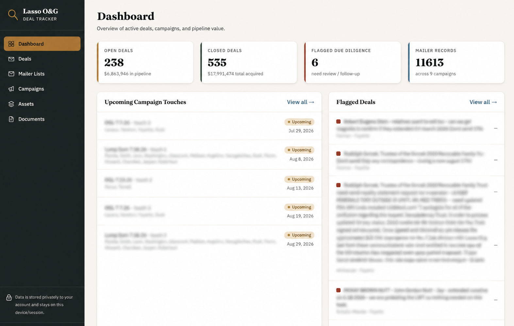
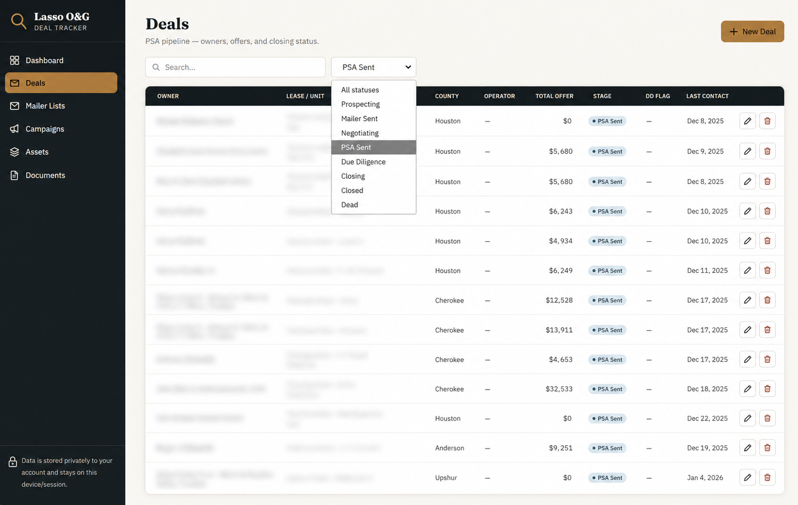
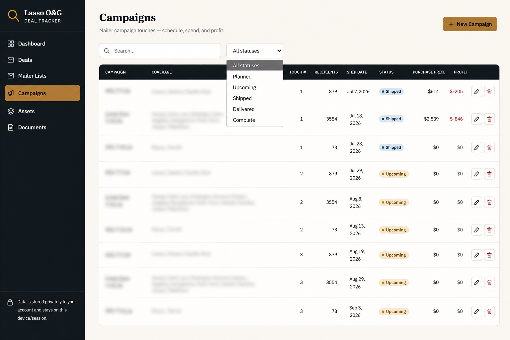
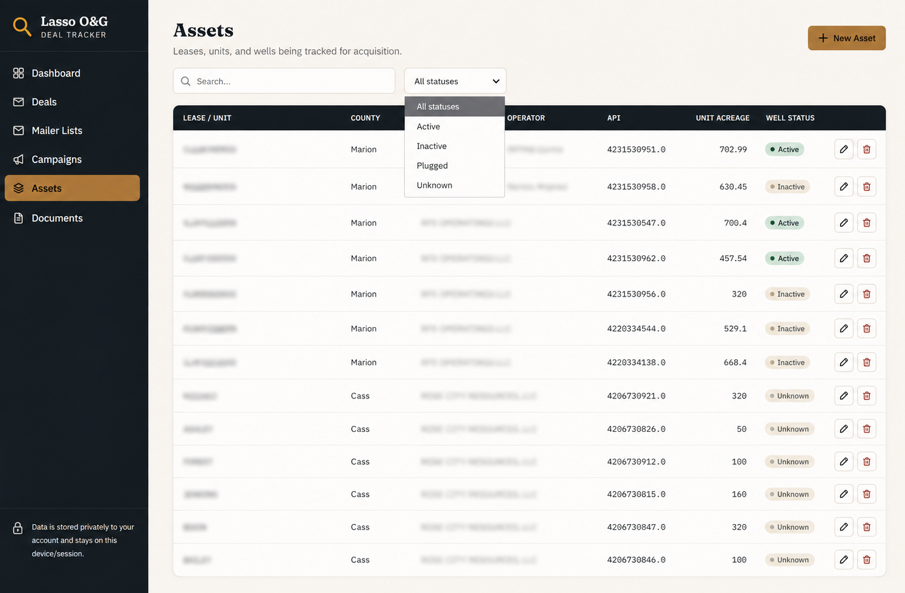
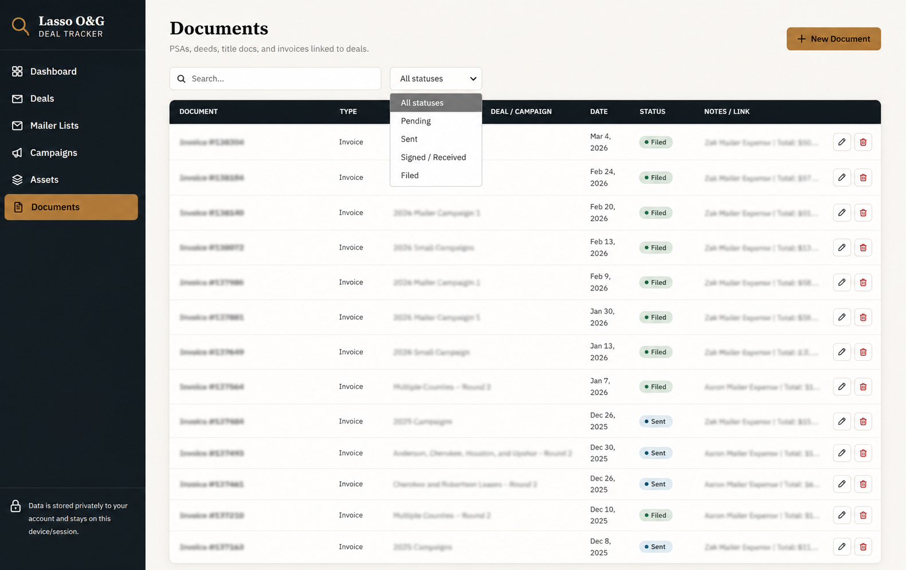

# Lasso O&G OS

> **An AI-Powered CRM & Operations Platform for Oil & Gas Mineral Acquisitions**


---

# Overview

Lasso O&G OS is a modern, AI-powered CRM and Operations Platform designed to streamline the complete mineral acquisition lifecycle for oil & gas companies.

The platform centralizes owner management, mail campaigns, acquisition tracking, Purchase & Sale Agreements (PSAs), Due Diligence, Title Review, Curative, Closing, Payments, Document Management, Reporting, and AI-powered workflow automation into a single operational workspace.

Instead of relying on spreadsheets, disconnected systems, and manual processes, Lasso O&G OS provides an integrated platform that improves visibility, collaboration, compliance, and operational efficiency across acquisition teams.

---

# Core Modules

## Dashboard

- Executive KPIs
- Pipeline overview
- Upcoming campaign touches
- Flagged Due Diligence
- Critical Curative items
- Closing pipeline
- Payment summary

---

## Deals

- Owner management
- Deal pipeline
- Offer tracking
- PSA lifecycle
- Internal notes
- Activity history

---

## Mailer Lists

- Owner records
- Mailing addresses
- Campaign assignments
- Mail tracking
- Response management

---

## Campaigns

- Mail campaign planning
- Multi-touch campaigns
- Campaign ROI
- Mailing schedules
- Cost tracking

---

## Assets

- Lease management
- Unit management
- Operator tracking
- API numbers
- Well information
- County records
- Acreage
- Production status

---

## Documents

Central repository for:

- Purchase & Sale Agreements
- Deeds
- Probate
- Affidavits
- Division Orders
- Closing Documents
- Invoices
- Maps
- Attachments

---

## Due Diligence

- Owner verification
- PSA validation
- Lease verification
- Operator review
- Risk assessment
- Acquisition readiness
- Go / No-Go recommendations

---

## Title Review

- Chain of title
- Ownership verification
- Title defects
- Legal review
- Curative generation

---

## Curative

- Probate tracking
- Affidavits
- Trust documentation
- Missing deeds
- Ownership corrections
- Legal issue resolution

---

## Closing

- Closing checklist
- Settlement preparation
- Closing coordination
- Funding approval
- Acquisition completion

---

## Payments

- Payment requests
- Accounting approvals
- Wire transfers
- Check tracking
- ACH support
- Reconciliation

---

## Reports

- Executive dashboards
- Pipeline analytics
- Financial reports
- Campaign performance
- County reporting
- Acquisition metrics

---

## AI Platform

- AI Assistant
- AI Deal Analyst
- AI Due Diligence
- AI Title Analyst
- AI Document Intelligence
- AI Search
- AI Reporting
- Workflow Automation

---

# Acquisition Lifecycle

```text
Lead
│
Mailer Lists
│
Campaigns
│
Deals
│
Offer Accepted
│
PSA Executed
│
Due Diligence
│
Title Review
│
Curative
│
Closing
│
Payments
│
Completed Acquisition
```

---

# Product Architecture

```text
Lasso O&G OS
│
├── Dashboard
├── Deals
├── Mailer Lists
├── Campaigns
├── Assets
├── Documents
├── Due Diligence
├── Title Review
├── Curative
├── Closing
├── Payments
├── Reports
├── Tasks
├── AI Platform
└── Settings
```

---

# Technology Stack

## Frontend

- HTML5
- CSS3
- JavaScript

## Backend (Planned)

- Node.js
- Express.js

## Database

- PostgreSQL
- Supabase

## AI

- Claude
- OpenAI GPT

## Automation

- n8n
- Make.com
- Google Apps Script

## Integrations

- Google Workspace
- Gmail
- Google Drive
- DocuSign
- Texas Railroad Commission (Planned)

---

# Repository Structure

```text
lasso-oil-gas-crm-system/
│
├── README.md
├── LICENSE
├── CHANGELOG.md
│
├── docs/
│
├── modules/
│   ├── Dashboard.md
│   ├── Deals.md
│   ├── Mailers.md
│   ├── Campaigns.md
│   ├── Assets.md
│   ├── Documents.md
│   ├── Due-Diligence.md
│   ├── Title-Review.md
│   ├── Curative.md
│   ├── Closing.md
│   ├── Payments.md
│   ├── Reports.md
│   ├── Tasks.md
│   └── AI/
│
├── assets/
│   └── screenshots/
│
├── diagrams/
│
└── database/
```

---

# Screenshots

## Dashboard



## Deals



## Mailer Lists


## Campaigns



## Assets



## Documents



---

# AI Roadmap

### Version 1.0

- AI Assistant
- AI Search
- AI Document Summaries

### Version 1.1

- AI Due Diligence
- AI Deal Analysis
- AI Reporting

### Version 2.0

- Voice Assistant
- AI Phone Agent
- GIS Intelligence
- Texas RRC Integration
- Predictive Analytics

---

# Project Goals

- Replace spreadsheet-based workflows
- Centralize acquisition operations
- Improve team collaboration
- Reduce manual work
- Standardize business processes
- Enable AI-assisted decision-making
- Scale acquisition operations

---

# Documentation

The repository includes comprehensive documentation covering:

- Product Architecture
- System Architecture
- Database Schema
- Business Workflows
- API Documentation
- Security
- Deployment
- Testing
- AI Platform
- Module Specifications

---

# Project Status

🚧 **Active Development**

Lasso O&G OS is currently under active development as an enterprise AI-powered CRM and Operations Platform focused on modernizing oil & gas mineral acquisition workflows.

---

# Intellectual Property

**Copyright © 2026 Maria Fe Blanca. All rights reserved.**

Lasso O&G OS is a proprietary software platform designed and developed by Maria Fe Blanca.

References to Lasso Oil & Gas LLC within this repository describe the operational workflows and business processes for which the platform was designed and do not transfer ownership of the software, documentation, or intellectual property.

---

# Author

**Maria Fe Blanca**

**AI Automation Developer • Software Architect • CRM Builder • Operations Systems Designer**

GitHub: https://github.com/mariafe-jmbrandify

LinkedIn: https://www.linkedin.com/in/maria-fe-blanca-754a1a267/

---

# License

This project is proprietary software.

See the **LICENSE** file for licensing terms and restrictions.
