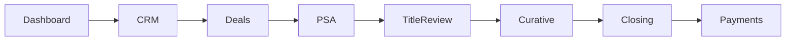
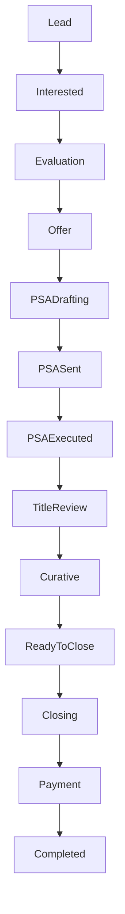
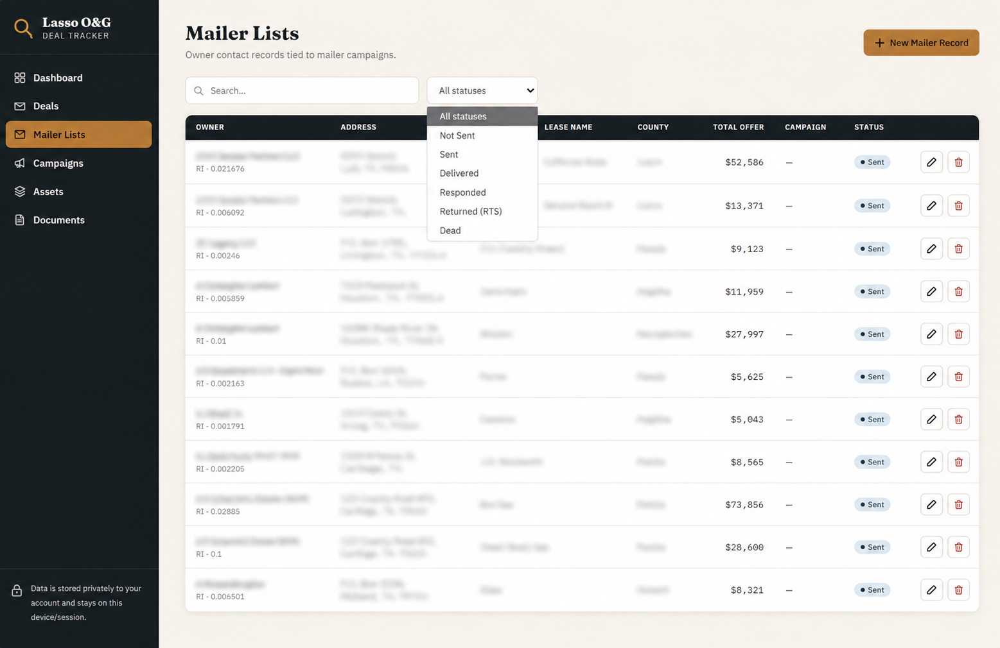

# Lasso O&G OS

> **An AI-powered CRM and Operations Platform for Oil & Gas Mineral Acquisitions**


---

## Table of Contents

- [Overview](#overview)
- [Why Lasso O&G OS?](#why-lasso-og-os)
- [Key Features](#key-features)
- [Product Architecture](#product-architecture)
- [Acquisition Workflow](#acquisition-workflow)
- [Technology Stack](#technology-stack)
- [Documentation](#documentation)
- [Repository Structure](#repository-structure)
- [Roadmap](#roadmap)
- [Current Status](#current-status)
- [Author](#author)
- [License](#license)

---

## Overview

Lasso O&G OS is a modern CRM and operations platform built to streamline the entire mineral acquisition process for oil & gas companies.

The platform centralizes owner management, PSA tracking, land assets, mail campaigns, due diligence, document management, closing, and payment workflows into one unified system.

Instead of relying on disconnected spreadsheets and manual tracking, Lasso O&G OS provides a single operational workspace that improves visibility, collaboration, and efficiency across the acquisition lifecycle.

---

## Why Lasso O&G OS?

Traditional mineral acquisition teams often rely on spreadsheets, email chains, shared drives, and disconnected CRM systems to manage complex acquisition workflows.

Lasso O&G OS replaces those fragmented tools with a centralized platform that manages every stage of the acquisition lifecycle—from prospecting and purchase agreements to title review, curative, closing, and payment.

The platform is designed to improve operational visibility, reduce manual work, standardize business processes, and enable AI-assisted decision-making.

---

## AI Capabilities

- Claude-powered operational assistant
- AI document summaries
- AI deal analysis
- Workflow recommendations
- Natural language search
- AI-generated daily briefings

---

## Key Features

### Dashboard

- Real-time acquisition metrics
- Deal pipeline overview
- Flagged due diligence items
- Upcoming campaign activity
- Mailer statistics
- Pipeline performance

---

### Deal Management

- Owner management
- Deal tracking
- Offer management
- PSA lifecycle
- Due diligence tracking
- Closing status
- Internal notes
- Activity history

---

### Mail Campaigns

- Mailing lists
- Campaign management
- Mail tracking
- Response tracking
- Returned mail management

---

### Land Assets

- Lease management
- Unit tracking
- Well information
- County records
- Operator information
- API tracking
- Unit acreage
- Production status

---

### Document Management

- Purchase & Sale Agreements
- Deeds
- Affidavits
- Royalty Statements
- Division Orders
- Closing Documents
- Invoices
- Attachments

---

### Reports

- Pipeline Reports
- Campaign Performance
- Deal Value
- County Reports
- Operator Reports
- Closing Reports
- Payment Reports

---

### AI & Automation (Roadmap)

- AI Deal Assistant
- AI Email Assistant
- AI Search
- AI Daily Brief
- AI Document Summary
- Chrome Extension
- Texas RRC Integration
- Google Sheets Synchronization

---

# Product Architecture



---

# Acquisition Workflow



---

# Technology Stack

### Frontend

- React
- Next.js
- Tailwind CSS
- TypeScript

### Backend

- Node.js
- Express.js (or NestJS)

### Database

- PostgreSQL
- Prisma ORM
- Supabase

### AI

- Claude
- OpenAI

### Automation

- n8n
- Make.com
- Google Apps Script

### Infrastructure

- GitHub Actions
- Docker
- Vercel
- Railway

---

## Documentation

| Document | Description |
|-----------|-------------|
| [docs/PROJECT_OVERVIEW.md](docs/PROJECT_OVERVIEW.md) | Product vision and goals |
| [docs/PRODUCT_ARCHITECTURE.md](docs/PRODUCT_ARCHITECTURE.md) | Product modules |
| [docs/SYSTEM_ARCHITECTURE.md](docs/SYSTEM_ARCHITECTURE.md) | System architecture |
| [docs/DATABASE_SCHEMA.md](docs/DATABASE_SCHEMA.md) | Database design |
| [docs/BUSINESS_WORKFLOWS.md](docs/BUSINESS_WORKFLOWS.md) | Operational workflows |
| [docs/PSA_DEALS.md](docs/PSA_DEALS.md) | Purchase & Sale Agreement workflow |
| [docs/TITLE_REVIEW.md](docs/TITLE_REVIEW.md) | Title examination |
| [docs/CURATIVE.md](docs/CURATIVE.md) | Curative process |
| [docs/CLOSING.md](docs/CLOSING.md) | Closing workflow |
| [docs/PAYMENTS.md](docs/PAYMENTS.md) | Payment processing |

## Roadmap

Planned enhancements include deeper AI automation, expanded integrations with industry systems, richer reporting, and more workflow orchestration across the acquisition lifecycle.

## Current Status

| Module | Status |
|---------|--------|
| Dashboard | ✅ Complete |
| CRM | ✅ Complete |
| Deals | ✅ Complete |
| Mailers | ✅ Complete |
| Assets | ✅ Complete |
| Documents | ✅ Complete |
| PSA | 🚧 In Progress |
| Title Review | 🚧 In Progress |
| Curative | 📋 Planned |
| Closing | 📋 Planned |
| Payments | 📋 Planned |
| AI Assistant | 📋 Planned |

---

# Repository Structure

```text
lasso-og-os/
│
├── docs/
│   ├── architecture/
│   ├── workflows/
│   ├── ai/
│   ├── business/
│   └── api/
│
├── frontend/
├── backend/
├── database/
├── automation/
├── chrome-extension/
├── assets/
│   ├── diagrams/
│   └── screenshots/
│
├── .claude/
├── .github/
└── README.md
```

---

# Screenshots

### Campaign


### Dashboard


### Deals


### Mailers



### Documents


---

## Author

Lasso O&G OS is being developed as an internal platform concept and repository initiative.

## License

This project is licensed under the MIT License. See [LICENSE](LICENSE) for details.

*Coming Soon*

### Assets

*Coming Soon*

### Documents

*Coming Soon*

---

# Current Modules

- ✅ Dashboard
- ✅ Deal Management
- ✅ Mailer Lists
- ✅ Campaigns
- ✅ Asset Management
- ✅ Document Management

---

# Planned Modules

- Due Diligence
- PSA Workflow
- Curative
- Closing
- Payments
- AI Assistant
- Notifications
- Reports
- User Roles
- Audit Logs
- Task Management
- Calendar

---

# Roadmap

## Version 1.0

- Dashboard
- Deals
- Mailers
- Campaigns
- Assets
- Documents

---

## Version 1.1

- Reports
- Notifications
- Tasks
- Activity Timeline

---

## Version 1.2

- AI Assistant
- Claude Integration
- Global Search
- Analytics

---

## Version 2.0

- Texas RRC Integration
- Chrome Extension
- Google Sheets Sync
- GIS Viewer
- Payment Automation

---

# Project Goals

- Replace spreadsheet-based workflows
- Improve deal visibility
- Reduce manual work
- Centralize operational data
- Support scalable acquisition operations
- Enable AI-assisted workflows

---

# Status

🚧 Lasso O&G OS is currently under active development.

The repository follows a documentation-first approach, with production-quality architecture, workflows, and operational specifications designed to support a scalable AI-powered CRM for mineral acquisition teams.

---

# Author

**Maria Fe Blanca**

AI Automation Developer • CRM Builder • Operations Systems Architect

GitHub: https://github.com/mariafe-jmbrandify

LinkedIn: https://www.linkedin.com/in/maria-fe-blanca-754a1a267/

---

# License

This project is licensed under the MIT License.
